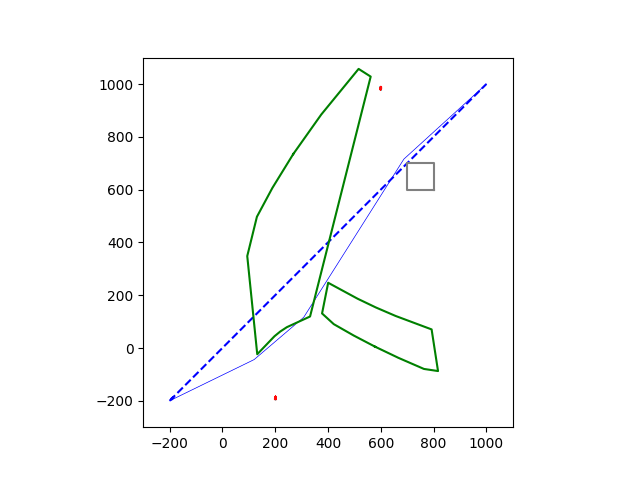
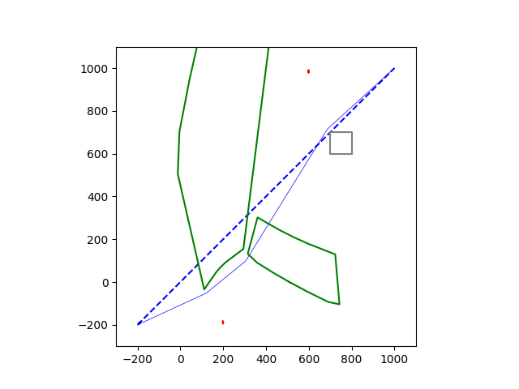
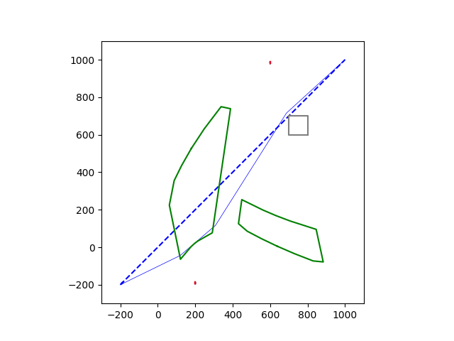
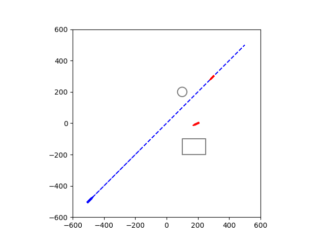
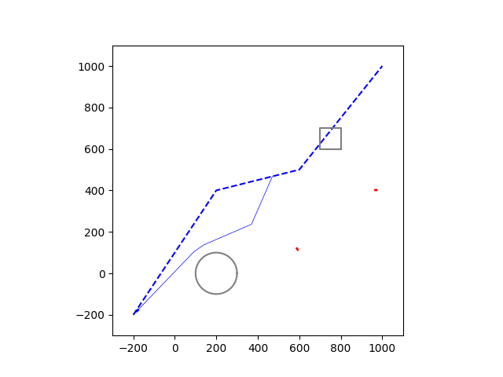
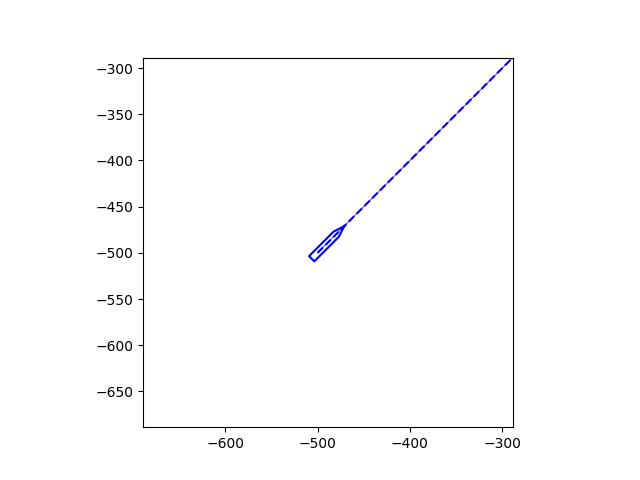

# TimeSpace-COLAV

A Python library for maritime collision avoidance using timespace projection and COLREGS compliance.

## Features

- **Timespace projection** for moving obstacle collision avoidance
- **COLREGS compliance** with International Regulations for Preventing Collisions at Sea
- **Maritime vessel dynamics** with uncertainty modeling
- **Visibility graph path planning** for collision-free trajectories
- **Scenario simulation** with visualization and analysis tools

## Installation

### From Source
```bash
git clone https://github.com/yourusername/timespace-colav.git
cd timespace-colav
pip install .
```

For development:
```bash
pip install -e .
```

## Quick Example

```python
import colav
from colav.scenarios import COLAVEnv, ScenarioRunner
from colav.obstacles import MovingShip
from colav.path.pwl import PWLPath

# Create own ship
own_ship = MovingShip.from_body(
    position=(0, 0), psi=45, u=8, v=0, 
    loa=50, beam=8, degrees=True
)

# Define path and obstacles
path = PWLPath([(0, 0), (500, 500)])
target_ship = MovingShip.from_body(
    position=(200, -100), psi=270, u=6, v=0,
    loa=40, beam=7, degrees=True
)

# Create simulation environment
env = COLAVEnv(
    own_ship=own_ship,
    path=path,
    desired_speed=8.0,
    obstacles=[target_ship],
    colregs=True
)

# Run scenario
runner = ScenarioRunner(env, tf=300, dt=2)
runner.run(xlim=(-100, 600), ylim=(-200, 600))
```

## Demonstrations

### Multi-Ship Collision Avoidance Scenarios

<table>
  <tr>
    <td align="center">
      
    </td>
    <td align="center">
      
    </td>
  </tr>
  <tr>
    <td align="center">
      
    </td>
    <td align="center">
      
    </td>
  </tr>
  <tr>
    <td align="center">
      
    </td>
    <td align="center">
      
    </td>
  </tr>
</table>

Real-time collision avoidance with time-space projection, COLREGS compliance, and multi-ship encounters

**Legend:**
- **Blue ship** → Own ship (vessel under control)
- **Red ships** → Target ships (obstacles to avoid)
- **Black polygons** → Static obstacles (shore, restricted areas)
- **Green polygons** → Timespace footprints of moving ships
- **Thick blue line** → Own ship's past trajectory
- **Thin blue line** → Collision-free trajectory (algorithm output)
- **Dashed blue line** → Global reference path to follow

## Getting Started

### Examples and Tutorials

The library includes comprehensive examples to help you get started:

**Scripts (`examples/scripts/`):**
- `scenarios_runner.py` - Complete collision avoidance demonstration
- `test_timespace_colav.py` - Basic functionality testing
- `interactive_encounter.py` - Interactive scenario exploration
- `filters.py` - Enforce trajectory constraints

**Notebooks (`examples/notebooks/`):**
- `tutorial.ipynb` - Step-by-step tutorial with explanations

Run the main demonstration:
```bash
python examples/scripts/scenarios_runner.py
```

### Core Components

**Time-Space Projection:**
```python
from colav.timespace import TimeSpaceProjector
projector = TimeSpaceProjector(desired_speed=10.0)
static_obstacles = projector.get(start, target, moving_ships)
```

**COLREGS Analysis:**
```python
from colav.colregs import get_recommendation_for_os
recommendation, info = get_recommendation_for_os(own_ship, target_ship)
```

**Path Planning:**
```python
from colav.planner import TimeSpaceColav
planner = TimeSpaceColav(desired_speed=10.0, colregs=True)
trajectory, info = planner.get(start, target, obstacles)
```

## Dependencies

- NumPy (≥1.20.0) - Numerical computations
- SciPy (≥1.7.0) - Scientific computing  
- Matplotlib (≥3.5.0) - Visualization
- Shapely (≥2.0.0) - Geometric operations
- NetworkX (≥2.6.0) - Graph algorithms

## License

MIT License - see LICENSE file for details.

## Development

This library is under active development. The API may change in future versions.

For development setup:
```bash
git clone https://github.com/yourusername/timespace-colav.git
cd timespace-colav
pip install -e ".[dev]"
```